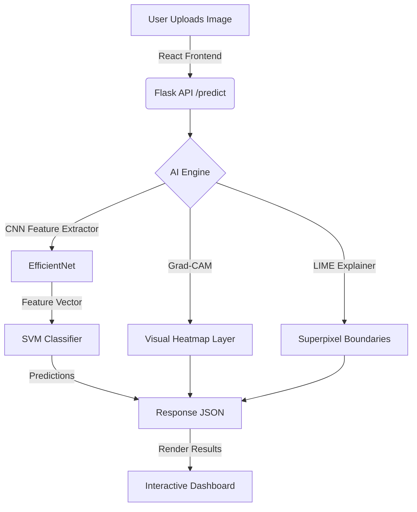

# 🏛️ DevAlaya: Digital Preservation & AI Analysis of Indian Temple Architecture

[](https://react.dev/)
[](https://threejs.org/)
[](https://www.python.org/)
[](https://www.tensorflow.org/)
[](https://flask.palletsprojects.com/)

**DevAlaya** (meaning *Abode of the Divine*) is a state-of-the-art digital heritage platform that preserves, classifies, and visualizes the architectural legacy of ancient Indian temples. Combining deep learning (EfficientNet), Explainable AI (Grad-CAM and LIME), and immersive 3D web graphics (React Three Fiber & Three.js), DevAlaya bridges the gap between historical heritage and modern technology.

---

## 🌟 Key Features

### 1. 🤖 AI Heritage Signature Classifier
* **Multi-Style Classification:** Automatically identifies major regional styles of Indian temple architecture: **Nagara** (North Indian), **Dravidian** (South Indian), and **Kalinga** (East Indian/Odishan).
* **EfficientNet CNN + SVM Pipeline:** Leverages an EfficientNet feature extractor combined with a Support Vector Machine (SVM) head, achieving high-accuracy classifications even with complex structural overlays.
* **Smart OOD Detection:** Flags images with low classification confidence as "Ambiguous/Non-Temple Signature" to ensure input validity.

### 2. 🔍 Explainable AI (XAI) Dashboard
* **Grad-CAM Visualizations:** Renders gradient-weighted class activation heatmaps to show exactly which architectural components (e.g., Shikharas, Vimanas, or Mandapa pillars) guided the CNN's classification.
* **LIME Superpixel Explainers:** Highlights granular textures, relief work, and structural boundaries that contributed to the model's prediction.

### 3. 🏺 Interactive 3D Virtual Museum
* **3D GLB Artifacts:** Displays interactive 3D models of iconic temples (including the Sun Temple of Konark, Dravidian Temple modular kits, and modern Nagara interpretations).
* **360° Inspection:** Allows users to pan, rotate, and zoom with responsive damping.
* **Curated Annotations:** Embedded info-overlays providing deep architectural insights into each displayed virtual artifact.

### 4. 📖 Heritage Lexicon & Style Guide
* **Interactive Anatomy Cards:** Exploration cards detailing the historical region, primary materials (granite, laterite, sandstone), and characteristics of each architectural style.

---

## 🛠️ Tech Stack

### Frontend (Digital Experience)
* **Framework:** React 18 + Vite (configured for HMR)
* **3D Engine:** Three.js, React Three Fiber (R3F), `@react-three/drei`
* **Animations:** Framer Motion (for fluid micro-animations)
* **Icons:** Lucide React
* **Styling:** CSS3 variables with rich dark-mode, glassmorphism, and gold accents

### Backend (AI Engine)
* **Framework:** Flask (Python) with CORS integration
* **Deep Learning:** TensorFlow 2.15 + Keras 3 (v3.12.3)
* **Classification Pipeline:** Scikit-Learn (SVM Classifier, Scaler, and Label Encoder), Joblib
* **Explainable AI (XAI):** LIME (Local Interpretable Model-agnostic Explanations), OpenCV-Python, Matplotlib, Scikit-Image

---

## 📐 Architecture & Data Flow



---

## 🚀 Getting Started

### Prerequisites
* **Node.js** (v16.x or newer)
* **Python** (v3.10.x recommended)

### Backend Setup
1. Navigate to the `backend` directory:
   ```bash
   cd backend
   ```
2. Activate the virtual environment:
   * **Windows:**
     ```bash
     .\venv\Scripts\activate
     ```
   * **macOS/Linux:**
     ```bash
     source venv/bin/activate
     ```
3. Install dependencies:
   ```bash
   pip install -r requirements.txt
   ```
4. Run the Flask development server:
   ```bash
   python app.py
   ```
   *The backend will boot up at `http://localhost:5000`.*

### Frontend Setup
1. Navigate to the `frontend` directory:
   ```bash
   cd ../frontend
   ```
2. Install dependencies:
   ```bash
   npm install
   ```
3. Start the Vite development server:
   ```bash
   npm run dev
   ```
   *The application will be accessible at `http://localhost:5173`.*

---

## 🎨 Design Aesthetics
DevAlaya features a premium, cultural aesthetic inspired by the heritage it preserves:
* **Color Palette:** Deep basalt/charcoal background (`#0F0A06`), warm parchment text (`#FAF3E0`), and sacred gold accents (`#FFD700`).
* **Glassmorphism:** Elegant frosted cards with subtle gold borders.
* **Typography:** Serif headings for historical authority, paired with clean sans-serif body text for readability.

---

## ⚖️ License
This project is open-source and available under the [MIT License](LICENSE).
