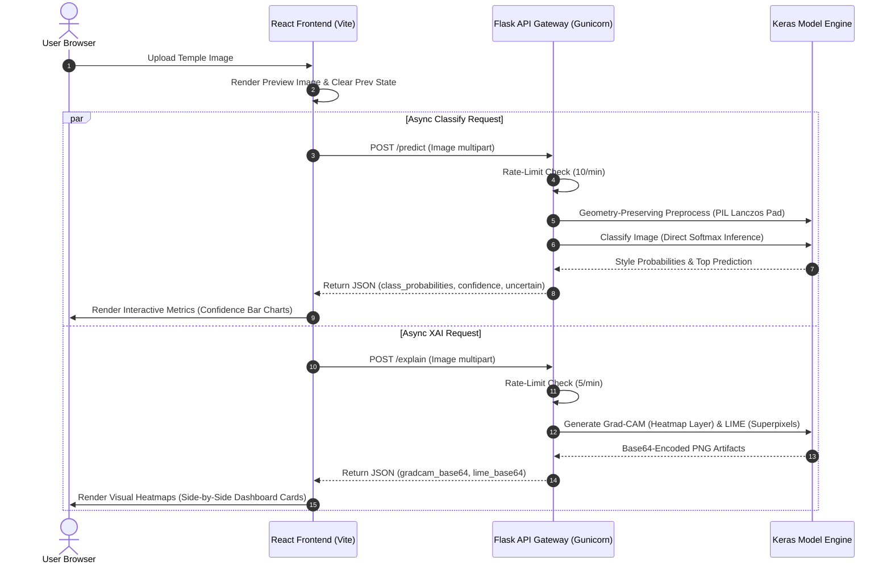

# 🏛️ DevAlaya: Digital Preservation & AI Analysis of Indian Temple Architecture

[](https://react.dev/)
[](https://threejs.org/)
[](https://www.tensorflow.org/)
[](https://keras.io/)
[](https://flask.palletsprojects.com/)
[](https://www.docker.com/)

**DevAlaya** (*Abode of the Divine*) is a professional-grade digital heritage platform designed to preserve, classify, and visualize the architectural legacy of ancient Indian temples. The application integrates deep convolutional neural networks (EfficientNet-B0), Explainable AI (Grad-CAM and LIME), and interactive 3D WebGL graphics (React Three Fiber & Three.js) to bridge historical preservation with cutting-edge machine learning and web experiences.

---

## 🚀 Key Engineering & Architecture Upgrades

Recently, the system architecture was refactored and optimized to transition from a prototype to a production-ready, high-performance portfolio application. 

### 1. 🧠 Direct Softmax Neural Classifier
* **Pipeline Simplification:** Migrated from a dual-stage pipeline (CNN Feature Extractor + SVM Classifier Head) to a direct, end-to-end Keras model (`devalaya_final_model.keras`). Predictions are generated using native softmax probability distributions directly from the fine-tuned CNN.
* **Granular Class Probabilities:** The frontend now displays a responsive bar-chart breakdown highlighting the exact network confidence for all regional styles: **Nagara** (North Indian), **Dravidian** (South Indian), and **Kalinga** (East Indian/Odishan).
* **Robust Out-of-Distribution (OOD) Flagging:** Implemented confidence filtering based on a threshold (`CONFIDENCE_THRESHOLD = 0.85`). Images failing to meet this classification threshold are elegantly flagged as "Ambiguous/Non-Temple Signature" to prevent false inferences.

### 2. 🔍 Decoupled & Async Explainable AI (XAI) Suite
* **Dual Explainers:** Configured **Grad-CAM** (gradient-weighted class activation heatmaps focused on the `top_activation` layer) and **LIME** (Local Interpretable Model-agnostic Explanations highlighting superpixel segment textures).
* **Asynchronous Execution:** Built a dedicated, non-blocking `/explain/` API endpoint. The frontend triggers the main classification `/predict` and the heavy XAI computations `/explain/` independently. This decoupled design ensures the user is presented with the classification result instantly, while XAI assets render in the background with a visual loading state.
* **Shared Engine Memory:** Explainer and predictor engines share the same pre-loaded model reference in-memory to prevent duplicate weights loading and minimize RAM usage.

### 3. 📐 Geometry-Preserving Image Preprocessing
* **The Problem:** Direct scaling of inputs to `224x224` distorted critical geometric proportions (e.g., squashing tall *Shikharas* or *Vimanas*), degrading model accuracy and activation mapping.
* **The Solution:** Upgraded the preprocessing pipeline using Pillow (`PIL.Image.LANCZOS` resampling). Images are scaled proportionally to fit within `224x224` and centered onto a black padding canvas. This preserves key architectural aspects, structural ratios, and angles.

### 4. ⚡ Production Server Optimization & Startup Latency Fix
* **Eager Initialization:** Integrated eager model initialization under `app_context()` during Flask app startup. This resolves the 10+ second "cold start" latency previously experienced by the first request.
* **API Rate Limiting:** Secured endpoints using `Flask-Limiter` (IP-based limits of `200 per day` and `50 per hour` globally, with strict `10 per minute` on predictions and `5 per minute` on explanations).
* **GIL-Safe Multiprocessing Gateway:** Configured `Gunicorn` with an optimized worker setup, disabling preload arguments to avoid multiprocessing deadlock conflicts during TensorFlow/OpenCV library forks.

### 5. 🐳 Containerized Orchestration
* **Dockerized Environment:** Created a multi-stage `Dockerfile` based on `python:3.10-slim`, bundling necessary native OpenCV dynamic libraries (`libglib2.0-0`, `libgl1`, `libsm6`, `libxrender-dev`, etc.).
* **Docker Compose Setup:** Orchestrated the service stack with a `docker-compose.yml` mapping the container's Gunicorn instance to port `5001` on the host, making deployment predictable and scriptable.

---

## 📐 System Flow & Data Pipeline



---

## 🛠️ Technology Stack

| Layer | Technologies | Role / Description |
| :--- | :--- | :--- |
| **Frontend** | React 18, Vite, React Three Fiber (R3F), Drei, Three.js, Framer Motion, Lucide Icons | Responsive 3D virtual museum, immersive rendering of GLB models, real-time animation, interactive analytics dashboard. |
| **Backend** | Flask 3.0, Flask-Cors, Flask-Limiter, Gunicorn | High-performance Python REST API, rate limiting, logging, model eager-loading. |
| **Deep Learning** | TensorFlow 2.20, Keras 3.12, PIL (Pillow), OpenCV | EfficientNet-B0 image classification, aspect-preserving canvas padding. |
| **Explainable AI** | LIME, Grad-CAM (TensorFlow Gradients), Matplotlib | Saliency maps, superpixel feature boundaries, and class activation heatmaps. |
| **DevOps** | Docker, Docker-Compose | Containerized deployment, system library configuration, ports mappings. |

---

## 📂 Repository Structure

```directory
DevAlaya/
├── backend/
│   ├── app.py                     # Flask entrypoint & eager loader
│   ├── config.py                  # Thresholds, dirs, and hyper-parameters
│   ├── Dockerfile                 # Production environment container setup
│   ├── docker-compose.yml         # Container mapping & port configuration (Host 5001)
│   ├── requirements.txt           # Python dependency manifests
│   ├── models/
│   │   ├── devalaya_final_model.keras  # Native Keras model weights
│   │   └── class_names.json       # Array of architecture styles [nagara, dravidian, kalinga]
│   ├── routes/
│   │   ├── predict_routes.py      # Standard prediction endpoint (/predict)
│   │   └── explain_routes.py      # Async explainability endpoint (/explain/)
│   └── services/
│       ├── predictor.py           # Aspect-ratio padding and CNN inference
│       └── gradcam.py             # Grad-CAM and LIME generation algorithms
├── frontend/
│   ├── src/
│   │   ├── components/            # UI components (ResultDisplay, ModelViewer, etc.)
│   │   ├── pages/                 # Routing pages (Home, Museum, etc.)
│   │   ├── App.jsx                # Layout orchestrator
│   │   └── index.css              # Global custom design variables (Basalt & Gold theme)
│   ├── package.json               # Node dependencies & Vite build configurations
│   └── vite.config.js             # Vite compiler definitions
└── README.md                      # Platform documentation
```

---

## 🚀 Getting Started & Setup

### Option A: Running Containerized (Recommended for Production)

Ensure you have **Docker** and **Docker Compose** installed.

1. **Build and start the backend service:**
   ```bash
   cd backend
   docker-compose up --build -d
   ```
   *The backend will compile and serve API endpoints on `http://localhost:5001`.*

2. **Run the frontend locally:**
   ```bash
   cd ../frontend
   npm install
   npm run dev
   ```
   *The application will boot on `http://localhost:5173`. Make sure your `.env` or Vite configurations point to host port `5001`.*

---

### Option B: Running Bare-Metal (Local Development)

#### Prerequisites
* **Node.js** (v18.x or newer)
* **Python** (v3.10.x recommended)

#### 1. Backend Setup
1. Move to the `backend` directory and instantiate a virtual environment:
   ```bash
   cd backend
   python -m venv venv
   ```
2. Activate the virtual environment:
   * **Windows (PowerShell):**
     ```powershell
     .\venv\Scripts\Activate.ps1
     ```
   * **macOS/Linux:**
     ```bash
     source venv/bin/activate
     ```
3. Install dependencies:
   ```bash
   pip install -r requirements.txt
   ```
4. Start the development server:
   ```bash
   python app.py
   ```
   *The local server boots up at `http://localhost:5000` (Note: Frontend defaults to `5001` for container testing, but fallback points to `5000` or can be overridden via `VITE_API_URL`).*

#### 2. Frontend Setup
1. Move to the `frontend` directory:
   ```bash
   cd ../frontend
   ```
2. Install npm packages:
   ```bash
   npm install
   ```
3. Boot the Vite development workspace:
   ```bash
   npm run dev
   ```

---

## 🎨 Cultural Design Aesthetics

DevAlaya matches its technological architecture with a premium visual design language honoring the heritage it represents:
* **Rich Color Palette:** A deep basalt background (`#0F0A06`), warm historic parchment typography (`#FAF3E0`), and radiant, sacred gold accents (`#FFD700`).
* **Glassmorphic Components:** Frosted panels with delicate gold borders, visual shadows, and translucent layouts.
* **Micro-Animations:** Fluid state transitions, hover effects on navigation elements, and smooth panning across 3D WebGL scenes to elevate user interaction.

---

## 🤝 Open API Reference

### 1. Classification Endpoint
* **URL:** `/predict`
* **Method:** `POST`
* **Headers:** `Content-Type: multipart/form-data`
* **Payload:** `image` (File binary)
* **Response (200 OK):**
  ```json
  {
    "success": true,
    "prediction": "dravidian",
    "confidence": 0.982,
    "uncertain": false,
    "class_probabilities": {
      "dravidian": 98.2,
      "nagara": 1.1,
      "kalinga": 0.7
    }
  }
  ```

### 2. Explanation Endpoint
* **URL:** `/explain/`
* **Method:** `POST`
* **Headers:** `Content-Type: multipart/form-data`
* **Payload:** `image` (File binary)
* **Response (200 OK):**
  ```json
  {
    "success": true,
    "prediction": "dravidian",
    "confidence": 0.982,
    "uncertain": false,
    "gradcam_base64": "iVBORw0KGgoAAAANSUhEUg...",
    "lime_base64": "iVBORw0KGgoAAAANSUhEUg..."
  }
  ```

---

## ⚖️ License & Attribution

This project is licensed under the [MIT License](LICENSE). 
*All 3D models of temple components, layout assets, and visual elements are curated for digital archaeological preservation and analysis.*
